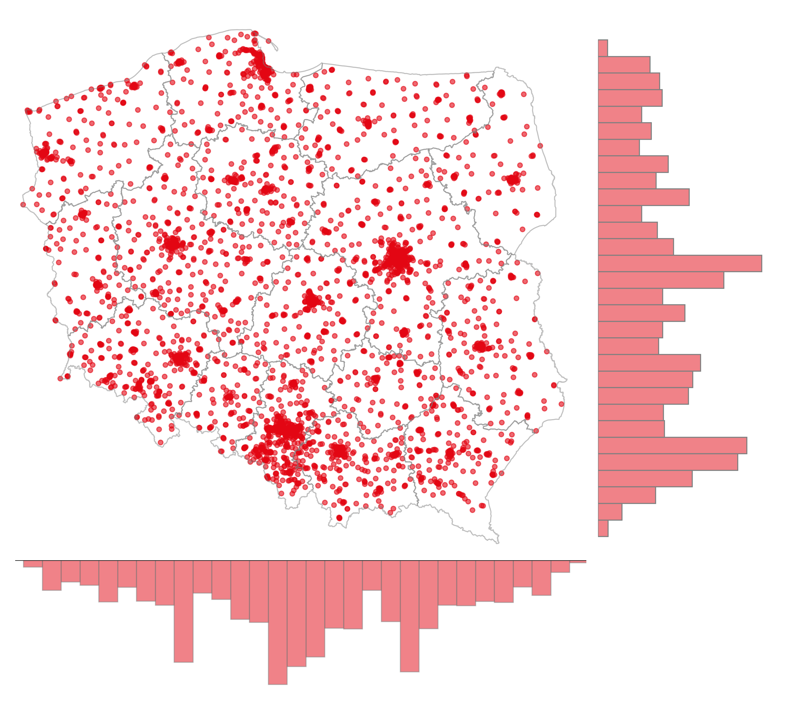

# Supermarkets Analysis

## Wprowadzenie

Niniejsza analiza przedstawia badanie konkurencji między trzema głównymi sieciami supermarketów w Polsce: Biedronka, Lidl i Dino. Dane pochodzą z OpenStreetMap (OSM) i zawierają informacje o lokalizacjach sklepów wraz z ich współrzędnymi geograficznymi.

Główne cele analizy:
- Określenie, które supermarkety mają konkurencję w bezpośrednim sąsiedztwie
- Analiza liczby konkurentów w różnych zakresach odległości
- Porównanie strategii lokalizacyjnych różnych sieci handlowych

Analiza wykorzystuje dane przestrzenne i obliczenia odległości w układzie współrzędnych EPSG:2180 (PUWG 1992), który jest standardowym układem dla Polski.

## 0. Dane źródłowe

Dane zawierają informacje o lokalizacjach supermarketów trzech głównych sieci handlowych w Polsce. Każdy rekord składa się z:
- **id**: Unikalny identyfikator sklepu z OSM
- **brand**: Nazwa sieci handlowej (Biedronka, Lidl, Dino)
- **location**: Współrzędne geograficzne w formacie POINT (longitude, latitude)

Próbka danych:

|id         |brand    |location                     |
|-----------|---------|-----------------------------|
|8.171.215  |Biedronka|POINT (19.187999 49.67997)   |
|9.362.792  |Biedronka|POINT (18.6484461 50.3002662)|
|13.082.781 |Biedronka|POINT (17.9648654 51.5295482)|
|100.918.564|Dino     |POINT (17.0237495 51.0996793)|
|101.838.001|Dino     |POINT (17.1080485 51.1669348)|
|133.555.559|Dino     |POINT (18.9122068 50.4938426)|
|27.564.945 |Lidl     |POINT (15.7371458 50.9072678)|
|30.137.380 |Lidl     |POINT (15.0445884 53.3327668)|
|33.849.686 |Lidl     |POINT (21.7733265 49.6806717)|

Do analizy użyłem bazy danych Posgres wraz z dodatkiem  PostGIS oraz aplikacji QGIS do analizy map.

## 1. Ile supermarketów ma konkurenta w pobliżu

### Przygotowanie danych

Pierwszym krokiem jest utworzenie tabeli pomocniczej, która dla każdego sklepu określa, czy ma konkurencję w promieniu 1 km. Zapytanie wykorzystuje funkcje przestrzenne PostGIS do obliczenia odległości między sklepami.

```sql
CREATE TABLE gis.supermarkets_competition AS (
WITH competition_analysis AS (
    SELECT 
        s1.id,
        s1.brand,
        s1.location,
        CASE 
            WHEN EXISTS (
                SELECT 1 
                FROM gis.supermarkets s2 
                WHERE s1.id != s2.id 
                AND   s1.brand != s2.brand 
                AND   ST_Distance(ST_Transform(s1.location, 2180), ST_Transform(s2.location, 2180)) <= 1000  -- 1km promień
            ) THEN true 
            ELSE false 
        END as has_competition
    FROM gis.supermarkets s1
    GROUP BY s1.id, s1.brand, s1.location
)
SELECT
    id,    
    brand, 
    location,
    has_competition
FROM competition_analysis
);
```

**Opis zapytania:**
- Transformuje współrzędne do układu EPSG:2180 dla dokładnych pomiarów w metrach
- Sprawdza dla każdego sklepu, czy istnieje konkurent innej marki w promieniu 1000 metrów
- Wynik zapisuje w kolumnie `has_competition` (true/false)

### Analiza konkurencji

Następne zapytanie agreguje wyniki i pokazuje statystyki konkurencji dla każdej sieci:

```sql
SELECT 
    brand as "Brand", 
    count(distinct id) as "Number of supermarkets",
    count(distinct case when has_competition = true then id else Null end) as "Supermarkets with competition",
    count(distinct case when has_competition = false then id else Null end) as "Supermarkets without competition",
    round(count(distinct case when has_competition = true then id else Null end)::decimal / count(distinct id)::decimal, 2) * 100 as "Ratio of supermarkets with competition"
FROM gis.supermarkets_competition
group by brand;
```

**Opis zapytania:**
- Oblicza łączną liczbę sklepów dla każdej marki
- Liczy sklepy z konkurencją i bez konkurencji w promieniu 1 km
- Wylicza procentowy udział sklepów z konkurencją

### Wyniki analizy konkurencji

|Brand    |Number of supermarkets|Supermarkets with competition|Supermarkets without competition|Ratio of supermarkets with competition|
|---------|----------------------|-----------------------------|--------------------------------|--------------------------------------|
|Biedronka|3.644                 |2.100                        |1.544                           |58 %                                  |
|Dino     |2.587                 |940                          |1.647                           |36 %                                  |
|Lidl     |934                   |840                          |94                              |90 %                                  |

**Analiza wyników:**
- **Lidl** ma najwyższy odsetek sklepów z konkurencją (90%), co wskazuje na strategię lokalizowania sklepów w obszarach o wysokiej konkurencji.
- **Biedronka** ma 58% sklepów z konkurencją, co przy największej liczbie placówek (3.644) oznacza znaczną obecność w różnych typach lokalizacji
- **Dino** ma najniższy odsetek konkurencji (36%), co może wskazywać na strategię zajmowania mniejszych miejscowości lub obszarów o niższej konkurencji


## 2. Ile konkurentów mają supermarkety?

### Przygotowanie danych o odległościach

Aby dokładniej przeanalizować konkurencję, tworzona jest tabela z odległościami między wszystkimi sklepami różnych marek w promieniu 10 km:

```sql
create table gis.supermarkets_distance_between_snapshot as (
	with crossed_data as (
		select 
			s1.id,
			s1.brand,
			s1.location,
			s2.id as id2,
			s2.brand as brand2,
			s2.location as location2,
			ST_Distance(ST_Transform(s1.location, 2180), ST_Transform(s2.location, 2180)) / 1000 AS distance_km
		from gis.supermarkets s1
		cross join gis.supermarkets s2
		where s1.brand <> s2.brand
	)
	select *
	from crossed_data 
	where distance_km <= 10
);
```

**Opis zapytania:**

- **Tworzenie par konkurencyjnych**: Wykorzystuje `CROSS JOIN` do porównania każdego sklepu z każdym innym sklepem różnej marki
- **Obliczanie odległości**: Transformuje współrzędne do układu EPSG:2180 i oblicza rzeczywiste odległości w kilometrach za pomocą funkcji PostGIS
- **Filtrowanie wyników**: Ogranicza dane do par sklepów oddalonych maksymalnie o 10 km, tworząc tabelę snapshot do dalszej analizy konkurencji

### Miejsca z największą liczbą konkurentów (0-1km)

```sql
with competitors_count as (
select 
    id as "ID", 
    brand as "Brand", 
    ST_Y(location) || ', ' || ST_X(location) as "Location",
    count(distinct id2) as "Total competitors",
    count(case when brand2 = 'Biedronka' then id2 else null end) as "Biedronka",
    count(case when brand2 = 'Lidl' then id2 else null end) as "Lidl",
    count(case when brand2 = 'Dino' then id2 else null end) as "Dino",
    row_number() over (partition by brand order by count(distinct id2) desc) as rn
from gis.supermarkets_distance_between_snapshot 
where 1=1
and distance_km <= 1
group by id, brand, location
having count(distinct id2) > 1
order by count(distinct id2) desc
)
select * from competitors_count
where rn <= 1;
```

**Opis zapytania:**
- Identyfikuje sklepy z największą liczbą konkurentów w promieniu 1 km
- Pokazuje rozkład konkurentów według marek
- Wykorzystuje funkcję okna `row_number()` do znalezienia najlepszego wyniku dla każdej marki

### Wyniki - miejsca z największą konkurencją

|ID           |Brand    |Location              |Total competitors|Biedronka|Lidl|Dino|
|-------------|---------|----------------------|-----------------|---------|----|----|
|225.524.811  |Lidl     |51.6970671, 17.4314813|9                |2        |0   |7   |
|2.349.066.013|Biedronka|51.6974301, 17.4388261|8                |0        |1   |7   |
|9.431.902.214|Dino     |51.0922987, 17.0354336|7                |6        |1   |0   |


Wrocław – Dino (zielona kropka) otoczony sklepami Biedronka (czerwone kropki) oraz Lidl (niebieskie kropki).


Krotoszyn – Duże skupisko sklepów Dino oraz dwie Biedronki i jeden Lidl.


### Średnia liczba konkurentów w różnych zakresach odległości

```sql
with competitors_count as (
SELECT 
    id, 
    brand,
    location,
    count(case when distance_km <= 1 then id2 else null end) as count_competitors_0_1km,
    count(case when distance_km > 1 and distance_km <= 5 then id2 else null end) as count_competitors_1_5km,
    count(case when distance_km > 5 and distance_km <= 10 then id2 else null end) as count_competitors_5_10km,
    count(distinct id2) as total_count_competitors_10km
FROM gis.supermarkets_distance_between_snapshot
group by id, brand, location
)
select 
    brand as "Brand", 
    round(avg(count_competitors_0_1km), 2) as "Average competitors in range 0-1km",
    round(avg(count_competitors_1_5km), 2) as "Average competitors in range 1-5km",
    round(avg(count_competitors_5_10km), 2) as "Average competitors in range 5-10km",
    round(avg(total_count_competitors_10km), 2) as "Average competitors in range 10km"
from competitors_count      
group by brand
order by "Average competitors in range 0-1km" desc;
```

**Opis zapytania:**
- Oblicza średnią liczbę konkurentów w różnych zakresach odległości dla każdej marki
- Dzieli konkurencję na strefy: 0-1km (bezpośrednia), 1-5km (lokalna), 5-10km (regionalna)
- Pozwala na porównanie strategii lokalizacyjnych różnych sieci

### Wyniki - średnia liczba konkurentów

|Brand    |Average competitors in range 0-1km|Average competitors in range 1-5km|Average competitors in range 5-10km|Average competitors in range 10km|
|---------|----------------------------------|----------------------------------|-----------------------------------|---------------------------------|
|Lidl     |1,86                              |12,18                             |19,08                              |33,12                            |
|Biedronka|0,76                              |4,2                               |6,97                               |11,92                            |
|Dino     |0,56                              |2,6                               |4,96                               |8,13                             |

**Analiza wyników:**
- **Lidl** ma najwyższą średnią konkurencję we wszystkich zakresach odległości, co potwierdza strategię lokalizowania sklepów w konkurencyjnych obszarach
- **Biedronka** ma umiarkowaną konkurencję, ale ze względu na największą liczbę placówek prawdopodobnie pokrywa różne typy lokalizacji
- **Dino** ma najniższą średnią konkurencję, co wskazuje na strategię ekspansji w mniejszych miejscowościach lub obszarach o niższej konkurencji

## Wnioski

1. **Różne strategie lokalizacyjne**: Lidl preferuje lokalizacje w obszarach o wysokiej konkurencji, podczas gdy Dino wybiera miejsca o niższej konkurencji. Moja wiedza lokalna potwierdza, że Lidle zlokalizowane są głownie w miastach, podczas gdy Dino znajduje sie głownie w mniejszych miescowościach.

2. **Lidl jako "agresor rynkowy"**: Wysoki odsetek sklepów z konkurencją (90%) oraz najwyższa średnia liczba konkurentów wskazują na agresywną strategię wchodzenia na rynki już obsługiwane przez konkurencję.

3. **Dino w niszach rynkowych**: Najniższa konkurencja może wskazywać na strategię obsługi mniejszych miejscowości lub obszarów pomijanych przez większe sieci.

4. **Biedronka jako lider rynkowy**: Największa liczba placówek przy umiarkowanej konkurencji wskazuje na dojrzałą strategię pokrywania różnych typów rynków.


Biedronka lokalizacje


Lidl lokalizacje


Dino lokalizacje

