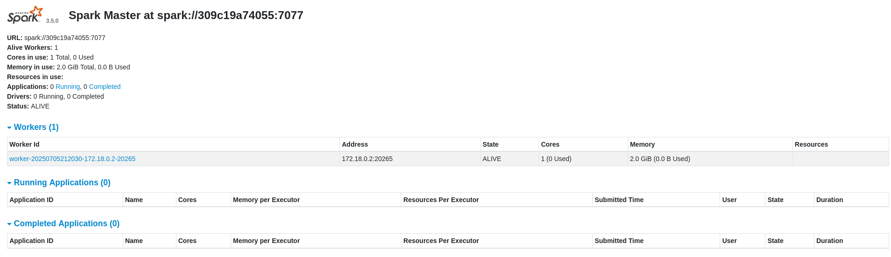
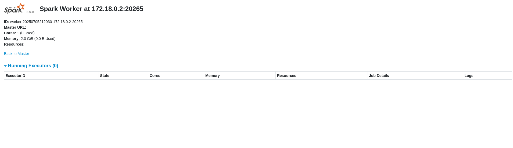
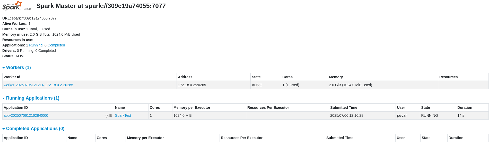
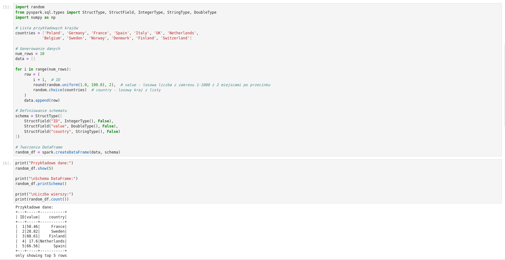
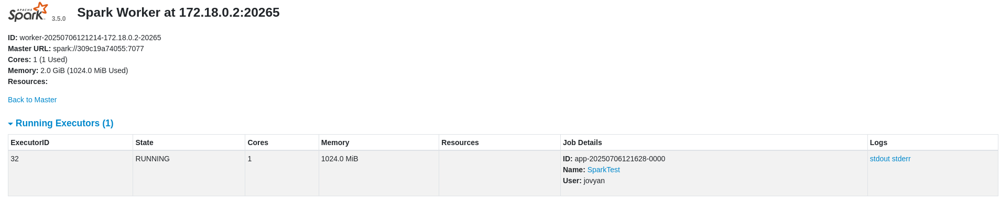
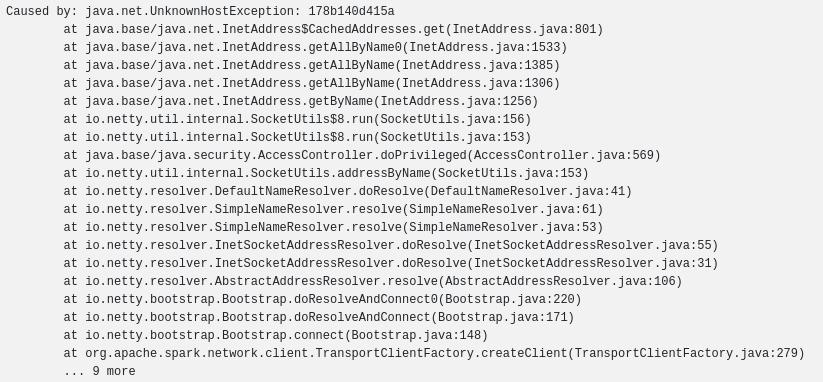

# Spark na Mikr.us

## 🚀 Opis
Projekt demonstruje uruchomienie klastra Apache Spark na platformie Mikr.us. Zawiera konfigurację Spark Master, Spark Worker oraz Jupyter Notebook do pracy z danymi.

## 📋 Wymagania wstępne
- Konto na [mikr.us](https://mikr.us/)
- Co najmniej 2 serwery Mikr.us 3.0 (2GB RAM, 25GB dysk)
- Podstawowa znajomość Docker i SSH
**Uwaga:** Usługa mikr.us jest przeznaczona do nauki i rozwoju oprogramowania. Z racji współdzielonych zasobów stosowanie Sparka na większą skalę może być niemożliwe.


## 🛠️ Konfiguracja

### Krok 1: Przygotowanie serwerów
1. Zakup serwerów na mikr.us (zalecane 2x Mikr.us 3.0)
2. Skonfiguruj logowanie SSH za pomocą kluczy (opcjonalne, ale wygodne)
3. Sprawdź przydzielone porty w panelu administracyjnym

### Krok 2: Spark Master
Na pierwszym serwerze uruchom Spark Master:

```yaml
services:
  spark-master:
    image: bitnami/spark:3.5.0
    container_name: spark-master
    ports:
      - "YOUR_PORT_1:8080"  # Spark Master Web UI
      - "YOUR_PORT_2:7077"  # Spark Master Port
    environment:
      - SPARK_MODE=master
```

**Uwaga:** Zastąp `YOUR_PORT_1` i `YOUR_PORT_2` portami przydzielonymi przez mikr.us.

### Krok 3: Spark Worker
Na drugim serwerze uruchom Spark Worker:

```yaml
services:
  spark-worker-1:
    image: bitnami/spark:3.5.0
    container_name: spark-worker-1
    ports:
      - "YOUR_PORT_3:8081"  # Spark Worker Web UI
    environment:
      - SPARK_MODE=worker
      - SPARK_WORKER_CORES=1
      - SPARK_WORKER_MEMORY=2G
      - SPARK_MASTER_URL=spark://srv01.mikr.us:YOUR_PORT_2
      - SPARK_WORKER_PORT=YOUR_PORT_4
```

**Ważne:** 
- `YOUR_PORT_2` to port Spark Master z poprzedniego kroku
- `YOUR_PORT_3` i `YOUR_PORT_4` to nowe porty przydzielone przez mikr.us

## 🎯 Weryfikacja działania

### Spark Master UI
Po uruchomieniu Spark Master będzie dostępny pod adresem:
```
http://srv01.mikr.us:YOUR_PORT_1
```



### Spark Worker UI
Spark Worker będzie widoczny pod adresem:
```
http://srv01.mikr.us:YOUR_PORT_3
```



## 📊 Dodanie Jupyter Notebook

### Krok 4: Konfiguracja Jupyter
Dodaj Jupyter do swojego docker-compose:

```yaml
jupyter:
  image: jupyter/pyspark-notebook:x86_64-spark-3.5.0
  container_name: jupyter
  environment:
    - PYSPARK_MASTER=spark://spark-master:YOUR_PORT_2
    - SPARK_DRIVER_PORT=YOUR_PORT_5
    - SPARK_UI_PORT=YOUR_PORT_7
  ports:
    - "YOUR_PORT_5:YOUR_PORT_5"  # Spark Driver
    - "YOUR_PORT_6:8888"   # Jupyter
    - "YOUR_PORT_7:YOUR_PORT_7"   # Spark UI
    - "YOUR_PORT_8:YOUR_PORT_8"  # spark.blockManager.port
  volumes:
    - ./notebooks:/home/jovyan/work
    - jupyter_data:/home/jovyan
  depends_on:
    - spark-master
```

### Krok 5: Konfiguracja Spark w Jupyter
W Jupyter Notebook użyj następującej konfiguracji:

```python
from pyspark.sql import SparkSession

spark = SparkSession.builder \
    .appName("SparkMikrus") \
    .config("spark.driver.host", "YOUR_SERVER_IP") \
    .config("spark.driver.port", "YOUR_PORT_5") \
    .config("spark.blockManager.port", "YOUR_PORT_8") \
    .getOrCreate()
```

**Uwaga:** Zastąp `YOUR_SERVER_IP` adresem IP serwera z Jupyter.

## ✅ Rezultat
Po poprawnym skonfigurowaniu zobaczysz:





## ⚠️ Rozwiązywanie problemów

### Problem: Spark Worker nie może się połączyć
**Objawy:** Brak wyników w Jupyter, błędy w logach

**Rozwiązanie:** 
1. Sprawdź logi Spark Worker w UI (sekcja "stderr")
2. Upewnij się, że podałeś poprawny adres IP i port Spark Driver
3. Sprawdź czy wszystkie porty są poprawnie przekierowane




### Problem: Błędy wersji Spark
**Rozwiązanie:** Upewnij się, że wszystkie komponenty używają tej samej wersji Spark (3.5.0).

## 🎯 Wskazówki
- **Porty:** Mikr.us ogranicza dostępne porty - sprawdź panel administracyjny
- **Wersje:** Wszystkie komponenty muszą używać tej samej wersji Spark
- **Sieć:** Spark Driver musi być dostępny dla Workerów
- **Monitoring:** Używaj UI Spark do monitorowania zadań

## 📁 Struktura projektu
```
spark_mikrus/
├── docker/
│   ├── spark-master/
│   └── spark-worker/
├── jupyter_notebooks/
│   └── spark.ipynb
├── utils/
│   └── (screenshots)
└── README.md
└── requirments.txt
```

## 🚀 Szybki start
```bash
# Uruchom Spark Master
cd docker/spark-master
docker-compose up -d

# Uruchom Spark Worker
cd ../spark-worker
docker-compose up -d

# Uruchom Jupyter
cd ../jupyter
docker-compose up -d
```
